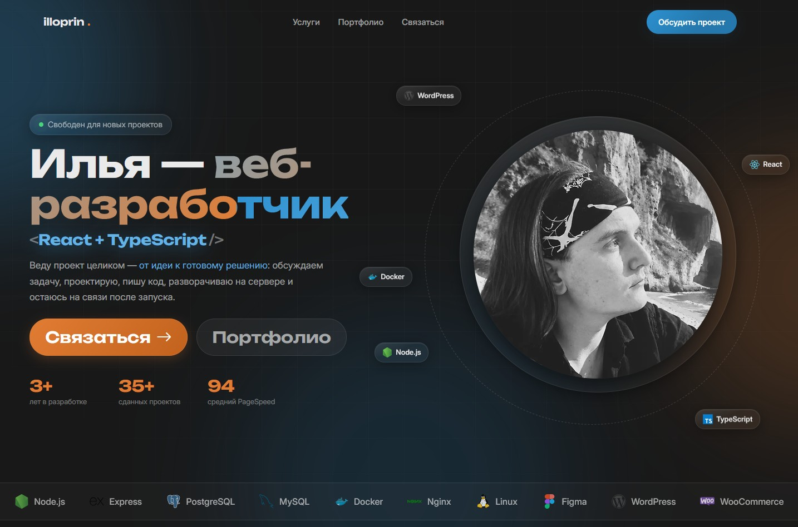

<h1 align="center">Illoprin Blog</h1>

<p align="center">
  <a href="https://illoprin.ru">illoprin.ru</a>
</p>

<p align="center">
  Персональный портфолио-сайт на кастомной WordPress-теме.<br>
  Стиль: Glassmorphism. Философия: минимум лишнего кода, максимум скорости.
</p>

<p align="center">
  
  
  
  
</p>

<p align="center">
  
</p>

---

## 💎 О проекте

Моя витрина технологий и подходов к разработке:

- Полностью кастомная верстка (без тяжелых билдеров/конструкторов) для максимальной скорости.
- Реализован сложный UI в стилистике Glassmorphism на чистом JS.
- Гибкая система кастомных полей через **Carbon Fields**
- 3 кастомных типа записей (Custom Post Types) под разные форматы контента.
- Сборка ассетов через **Node.js**.
- Реализовано кеширование с помощью Redis
- Полностью упакован в **Docker**, поднимается на любой машине одной командой.

## 🛠️ Стек технологий

| Область         | Технология                      |
| --------------- | ------------------------------- |
| Backend / CMS   | WordPress (Custom Theme)        |
| Кастомные поля  | Carbon Fields                   |
| Frontend        | Vanilla JS, CSS (Glassmorphism) |
| Сборщик         | Кастом на Node.js               |
| Зависимости PHP | Composer                        |
| Инфраструктура  | Docker / Docker Compose         |
| Кеширование     | Redis                           |

## 🚀 Как запустить (Getting Started)

Для запуска проекта локально потребуется установленный **Docker**, **Composer** и **Node.js**.

**1. Перейти в директорию темы**

```bash
cd wp-content/themes/illoprinblog26
```

**2. Установить PHP-зависимости**

> Необходимо для работы плагина Carbon Fields (кастомные поля в WP)

```bash
composer install
```

**3. Установить JS-зависимости**

> Установит все пакеты, необходимые для сборки Vite

```bash
npm i
```

**4. Собрать статику**

> Соберет и минифицирует CSS/JS файлы в production-режиме

```bash
npm run build
```

**5. Поднять окружение**

> Запустит контейнеры WordPress, MySQL и т.д. в фоновом режиме

```bash
docker compose -f docker-compose.dev.yml up -d
```

Готово. Сайт доступен локально по адресу, указанному в конфигурации `docker-compose.dev.yml`.

---

<p align="center">
  Made with ❤️ and minimal effort by <a href="https://github.com/illoprin">illoprin</a>
</p>
